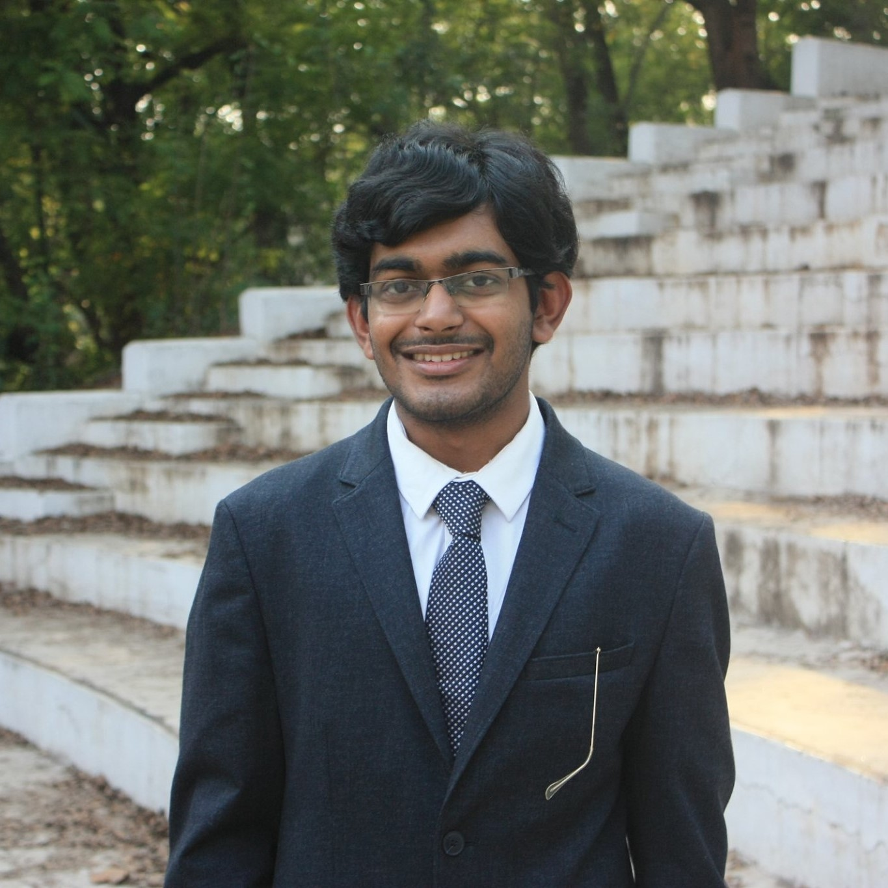

### About

I am an undergraduate in Computer Science and Engineering graduated from National Institute of Technology, Rourkela in 2019. My interests include Competitive Programming, Software Development, and Machine Learning. I like playing badminton, solving logic puzzles, and listening music in my leisure time. I write and improve articles related to Computer Science at [GeeksforGeeks](https://www.geeksforgeeks.org/), some of which can be found [here](https://auth.geeksforgeeks.org/user/dt_kanha/articles). 

Notable profiles.

1. [CodeChef](https://www.codechef.com/users/dt_1997)
2. [HackerRank](https://www.hackerrank.com/dt_kanha)
3. [HackerEarth](https://www.hackerearth.com/@dattatreya3)
4. [GeeksforGeeks](https://auth.geeksforgeeks.org/user/dt_kanha/profile)

<footer>
  <a href="mailto:dt.kanha@gmail.com">Gmail</a> | <a href="http://github.com/dt97">GitHub</a> | <a href="https://www.linkedin.com/in/dattatreya-tripathy-51b809115/">LinkedIn</a>
</footer>
